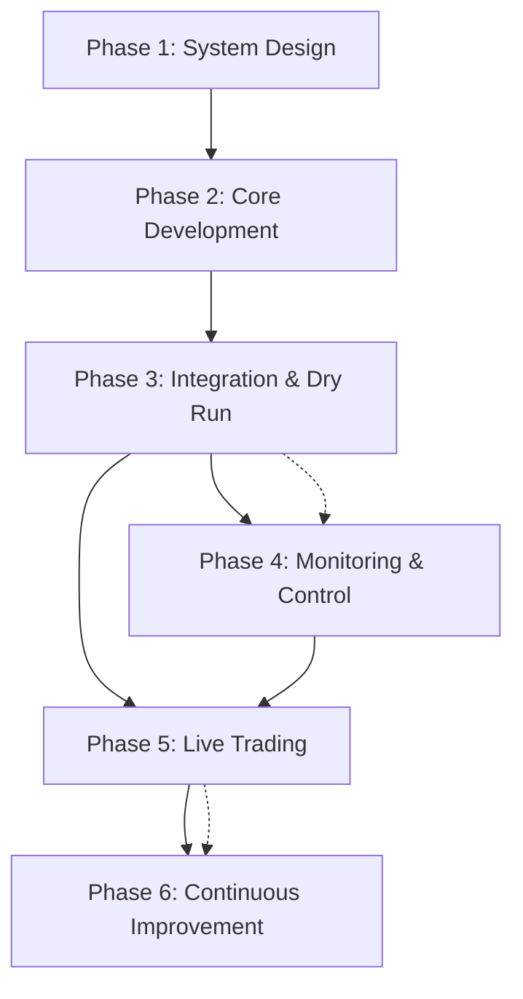

# Development Roadmap & Progress Tracking

This roadmap provides an overview of the development phases for the Spark Stacker trading system.
For detailed implementation checklists, progress status, and technical details, please refer to the
phase-specific checklist files.

## Phase 1: System Design & Planning

**Status: COMPLETED** **Dependencies: None**

Core activities:

- Define system architecture and components
- Research exchange APIs (Hyperliquid, Synthetix, Coinbase)
- Design indicator framework and risk management
- Create core product requirements and documentation

[Detailed Phase 1 Checklist](./checklists/phase1-system-design-planning.md)

## Phase 2: Core Development & Backtesting

**Status: PARTIALLY COMPLETED (75%)** **Dependencies: Phase 1** **Critical Path: Backtesting
Framework**

Core activities:

- Implement exchange connectors for Hyperliquid and Coinbase
- Develop indicator framework and initial indicators (RSI)
- Create risk management system with hedging capabilities
- Implement order execution logic
- Develop backtesting framework (pending)

[Detailed Phase 2 Checklist](./checklists/phase2-core-development-backtesting.md)

## Phase 3: Integration & Dry Run

**Status: PARTIALLY COMPLETED (80%)** **Dependencies: Phase 2** **Parallel Work: Basic Monitoring
Setup**

Core activities:

- Integrate all components into a cohesive system
- Implement comprehensive testing
- Add security features and error handling
- Create containerization and deployment infrastructure
- Run dry tests on testnets

[Detailed Phase 3 Checklist](./checklists/phase3-integration-dry-run.md)

## Phase 4: Monitoring & Control Interface

**Status: PLANNED** **Dependencies: Phase 3 (Partial)** **Can Start: During Phase 3** **Parallel
Work: Basic Control Interface**

Core activities:

- Set up NX monorepo structure
- Implement Grafana-based monitoring system
- Create performance and health dashboards
- Develop control interface for strategy management
- Add real-time alerts and notifications

[Detailed Phase 4 Checklist](./checklists/phase4-monitoring-control-interface.md)

## Phase 5: Deployment & Live Trading

**Status: PLANNED** **Dependencies: Phase 3, Phase 4** **Cannot Start Until: Dry Run Complete &
Basic Monitoring Ready**

Core activities:

- Configure production environment
- Implement CI/CD pipeline
- Deploy with minimal initial capital
- Monitor system under real conditions
- Analyze performance and optimize execution

[Detailed Phase 5 Checklist](./checklists/phase5-deployment-live-trading.md)

## Phase 6: Continuous Improvement & Expansion

**Status: PLANNED** **Dependencies: None (Can Start During Phase 5)** **Parallel Work: Independent
Features**

Core activities:

- Add advanced order types (trailing stops, OCO orders)
- Implement additional exchange connectors
- Create advanced risk management features
- Integrate machine learning capabilities
- Develop extended analytics and reporting
- Implement comprehensive testing improvement plan to reach 85%+ code coverage

[Detailed Phase 6 Checklist](./checklists/phase6-continuous-improvement-expansion.md)

## Progress Summary

| Phase                             | Status         | Completion % | Dependencies      | Critical Path Items                          |
| :-------------------------------- | :------------- | :----------: | :---------------- | :------------------------------------------- |
| 1: System Design & Planning       | ✅ Complete    |     100%     | None              | -                                            |
| 2: Core Development & Backtesting | 🟡 In Progress |     75%      | Phase 1           | Backtesting framework, additional indicators |
| 3: Integration & Dry Run          | 🟡 In Progress |     80%      | Phase 2           | End-to-end testing, performance evaluation   |
| 4: Monitoring & Control Interface | 🔲 Planned     |      0%      | Phase 3 (Partial) | Basic monitoring, core control interface     |
| 5: Deployment & Live Trading      | 🔲 Planned     |      0%      | Phase 3, Phase 4  | Dry run completion, monitoring readiness     |
| 6: Continuous Improvement         | 🔲 Planned     |      0%      | None              | Independent features                         |

## Development Timeline

## Critical Path Analysis

1. **Immediate Focus**

   - Complete backtesting framework in Phase 2
   - Start basic monitoring setup during Phase 3
   - Begin essential control interface development

2. **Risk Mitigation**

   - Implement basic monitoring earlier in the process
   - Start with minimal viable control interface
   - Focus on core functionality before advanced features

3. **Resource Allocation**
   - Prioritize backtesting framework completion
   - Allocate resources to parallel development where possible
   - Focus on critical path items before nice-to-have features

This roadmap ensures structured development with clear milestones, allowing for incremental
validation and capital protection during the deployment process.
