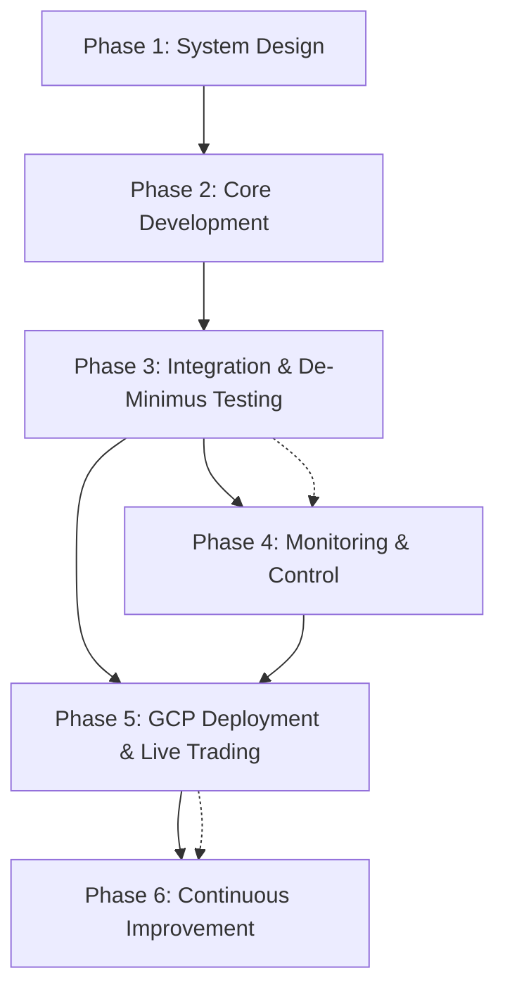

# Development Roadmap & Progress Tracking

This roadmap provides an overview of the development phases for the Spark Stacker trading system.
For detailed implementation checklists, progress status, and technical details, please refer to the
phase-specific checklist files.

## Phase 1: System Design & Planning

**Status: COMPLETED** **Dependencies: None**

Core activities:

- Define system architecture and components
- Research exchange APIs (Hyperliquid, Synthetix, Coinbase)
- Design indicator framework and risk management
- Create core product requirements and documentation

[Detailed Phase 1 Checklist](./checklists/phase1-system-design-planning.md)

## Phase 2: Core Development & Backtesting

**Status: PARTIALLY COMPLETED (85%)** **Dependencies: Phase 1** **Critical Path: Backtesting
Framework**

Core activities:

- Implement exchange connectors for Hyperliquid and Coinbase
- Develop indicator framework and initial indicators (RSI)
- Create risk management system with hedging capabilities
- Implement order execution logic
- Develop backtesting framework (completed)
- Implement enhanced testing framework with real market data support (completed)
  - Market data caching system for test reliability
  - Automatic refresh functionality for current data
  - Synthetic data generation as fallback
  - Position management testing suite
  - Integration tests with MACD and real market data

[Detailed Phase 2 Checklist](./checklists/phase2-core-development-backtesting.md)

## Phase 3: Integration & De-Minimus Testing

**Status: PARTIALLY COMPLETED (80%)** **Dependencies: Phase 2** **Parallel Work: Basic Monitoring
Setup**

Core activities:

- Integrate all components into a cohesive system
- Implement comprehensive testing
- Add security features and error handling
- Create containerization and deployment infrastructure
- Run de-minimus tests with small real capital on production exchanges
- Implement 1-minute timeframe support for accelerated testing cycles
- Validate with $1.00 positions on Hyperliquid

[Detailed Phase 3 Checklist](./checklists/phase3-integration-dry-run.md)

## Phase 4: Monitoring & Control Interface

**Status: PLANNED** **Dependencies: Phase 3 (Partial)** **Can Start: During Phase 3** **Parallel
Work: Basic Control Interface**

Core activities:

- Set up NX monorepo structure
- Implement Grafana-based monitoring system
- Create performance and health dashboards
- Develop control interface for strategy management
- Add real-time alerts and notifications
- Prepare Google Cloud Platform deployment architecture
- Implement 1-minute monitoring for short-term strategy validation

[Detailed Phase 4 Checklist](./checklists/phase4-monitoring-control-interface.md)

## Phase 5: Deployment & Live Trading

**Status: PLANNED** **Dependencies: Phase 3, Phase 4** **Cannot Start Until: De-Minimus Testing
Complete & Basic Monitoring Ready**

Core activities:

- Configure production environment on Google Cloud Platform
- Implement CI/CD pipeline for GCP
- Deploy with increased capital based on de-minimus testing results
- Monitor system under real conditions with GCP monitoring stack
- Analyze performance and optimize execution

[Detailed Phase 5 Checklist](./checklists/phase5-deployment-live-trading.md)

## Phase 6: Continuous Improvement & Expansion

**Status: PLANNED** **Dependencies: None (Can Start During Phase 5)** **Parallel Work: Independent
Features**

Core activities:

- Add advanced order types (trailing stops, OCO orders)
- Implement additional exchange connectors
- Create advanced risk management features
- Integrate machine learning capabilities
- Develop extended analytics and reporting
- Implement comprehensive testing improvement plan to reach 85%+ code coverage

[Detailed Phase 6 Checklist](./checklists/phase6-continuous-improvement-expansion.md)

## Progress Summary

| Phase                               | Status         | Completion % | Dependencies      | Critical Path Items                                       |
| :---------------------------------- | :------------- | :----------: | :---------------- | :-------------------------------------------------------- |
| 1: System Design & Planning         | ✅ Complete    |     100%     | None              | -                                                         |
| 2: Core Development & Backtesting   | 🟡 In Progress |     85%      | Phase 1           | Backtesting framework, additional indicators              |
| 3: Integration & De-Minimus Testing | 🟡 In Progress |     80%      | Phase 2           | End-to-end testing, real-money validation                 |
| 4: Monitoring & Control Interface   | 🔲 Planned     |      0%      | Phase 3 (Partial) | Basic monitoring, core control interface, GCP integration |
| 5: Deployment & Live Trading        | 🔲 Planned     |      0%      | Phase 3, Phase 4  | De-minimus testing completion, cloud deployment readiness |
| 6: Continuous Improvement           | 🔲 Planned     |      0%      | None              | Independent features                                      |

## Critical MVP MACD Strategy Implementation

A critical milestone in our development roadmap is the implementation of a MACD-based trading
strategy as a proof-of-concept for the entire system. This will serve as a practical validation of
all system components before full-scale deployment.

### MVP Strategy Details

- **Indicator:** MACD with parameters Fast=8, Slow=21, Signal=5
- **Market:** ETH-USD perpetual futures on Hyperliquid
- **Timeframe:** 1-minute candles
- **Position Size:** $1.00 maximum per position
- **Risk Parameters:**
  - Leverage: 10×
  - Stop-loss: 5%
  - Take-profit: 10%
  - Hedge ratio: 20%

### Implementation Priorities

1. **Phase 2 Dependencies:**

   - Complete MACD indicator implementation with custom parameters
   - Ensure market data retrieval for 1-minute timeframes works properly
   - Adapt position sizing for micro-positions ($1.00 max)

2. **Phase 3 Integration:**

   - Configure strategy parameters in production-ready code
   - Implement de-minimus testing with $1.00 positions on production Hyperliquid exchange
   - Verify strategy execution and trade lifecycle management
   - Use 1-minute timeframes for accelerated feedback cycles

3. **Phase 4 Monitoring:**

   - Create dedicated MACD strategy dashboard with 1-minute resolution
   - Implement strategy-specific metrics and alerts
   - Ensure real-time monitoring of indicator values and trading signals
   - Prepare Google Cloud Platform monitoring setup

4. **Phase 5 Deployment:**
   - Deploy to Google Cloud Platform for persistent operation
   - Implement cloud-based monitoring and alerting
   - Ensure secure credential management in cloud environment

### Validation Criteria:\*\*

- Successfully identify and act on MACD crossovers in 1-minute timeframes
- Execute trades with proper position sizing and hedging on production exchange
- Monitor and visualize strategy performance in real-time
- Implement all risk management features (stop-loss, take-profit, etc.)
- Validate persistent operation in cloud environment

This MVP implementation is a critical step in proving the system's functionality. Successful
execution of this strategy with minimal capital ($1.00 positions) on the production Hyperliquid
exchange will validate all core components while minimizing financial risk during the evaluation
phase.

## Development Timeline

## Critical Path Analysis

1. **Immediate Focus**

   - Complete backtesting framework in Phase 2
   - Implement de-minimus real-money testing with $1.00 positions
   - Start basic monitoring setup during Phase 3
   - Begin GCP deployment preparation

2. **Risk Mitigation**

   - Use 1-minute timeframes for faster validation cycles
   - Test with real funds but minimal position sizes
   - Implement basic monitoring for active observation periods
   - Prepare cloud deployment for persistent operation

3. **Resource Allocation**
   - Prioritize Hyperliquid exchange integration for MACD MVP
   - Focus on 1-minute candle support for rapid feedback
   - Allocate resources to GCP deployment preparation
   - Ensure monitoring tools support high-frequency data

This roadmap ensures structured development with clear milestones, allowing for incremental
validation and capital protection during the deployment process, with a focus on real production
testing and cloud deployment for persistent operation.
