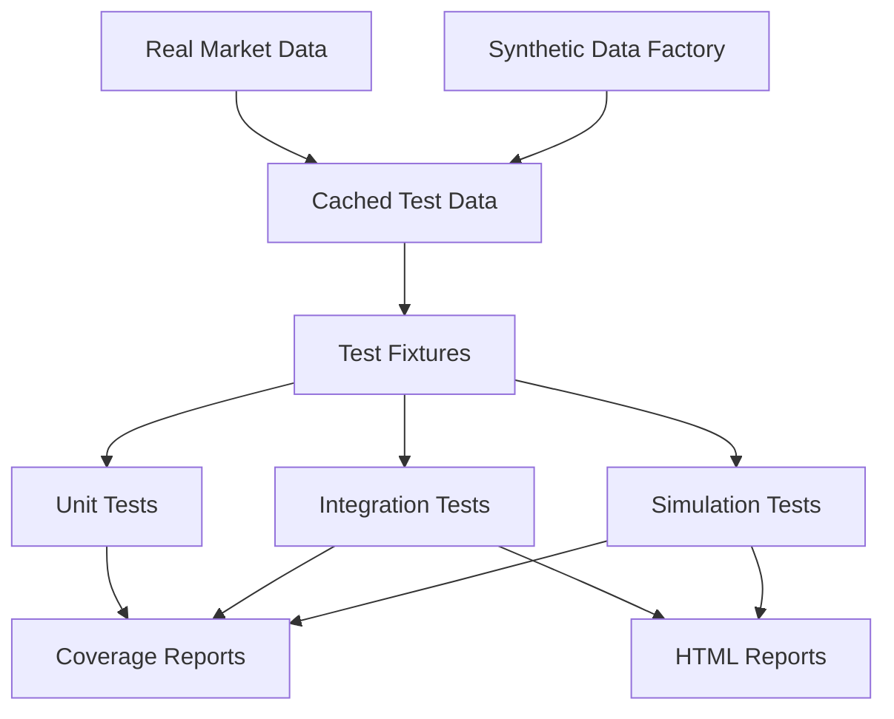
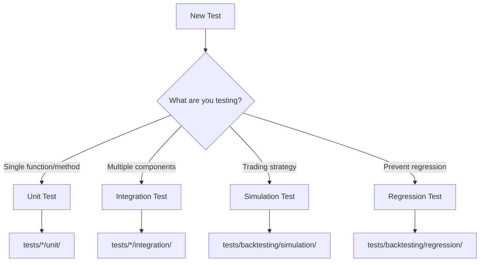
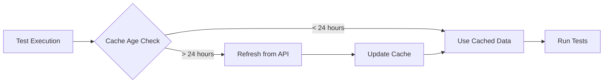

# 🧪 Spark Stacker Testing Suite

> **Complete Guide to Testing Framework & Methodology**

A comprehensive testing framework for the Spark Stacker trading system, featuring real market data integration, automated report generation, and systematic indicator validation.

---

## 📋 Table of Contents

- [🧪 Spark Stacker Testing Suite](#-spark-stacker-testing-suite)
  - [📋 Table of Contents](#-table-of-contents)
  - [🎯 Overview \& Philosophy](#-overview--philosophy)
    - [Core Principles](#core-principles)
    - [Testing Paradigm](#testing-paradigm)
  - [📁 Directory Structure](#-directory-structure)
    - [Core Directories](#core-directories)
    - [Directory Details](#directory-details)
  - [🔍 Testing Categories \& Coverage Matrix](#-testing-categories--coverage-matrix)
    - [Current Coverage Status](#current-coverage-status)
    - [Future Coverage Needs](#future-coverage-needs)
  - [🚀 Getting Started](#-getting-started)
    - [Prerequisites](#prerequisites)
    - [Environment Setup](#environment-setup)
    - [Quick Test Commands](#quick-test-commands)
  - [⚡ CLI Usage](#-cli-usage)
    - [Available Commands](#available-commands)
    - [Command Examples](#command-examples)
      - [🎯 Run Indicator Demo with Synthetic Data](#-run-indicator-demo-with-synthetic-data)
      - [📈 Run Backtest with Real Market Data](#-run-backtest-with-real-market-data)
      - [🔧 Custom Backtest Configuration](#-custom-backtest-configuration)
      - [📋 List Available Indicators](#-list-available-indicators)
  - [📊 Report Generation](#-report-generation)
    - [Automated Report Generation](#automated-report-generation)
    - [Manual Report Generation](#manual-report-generation)
      - [📊 Generate Report from JSON Results](#-generate-report-from-json-results)
      - [📈 Generate Comparison Report](#-generate-comparison-report)
    - [Report Types](#report-types)
      - [📋 **Single Indicator Report**](#-single-indicator-report)
      - [📊 **Comparison Report**](#-comparison-report)
      - [🎯 **Test Harness Report**](#-test-harness-report)
  - [✨ Adding New Tests](#-adding-new-tests)
    - [Test Categories \& Placement](#test-categories--placement)
    - [Creating Unit Tests](#creating-unit-tests)
      - [🧪 **Basic Unit Test Template**](#-basic-unit-test-template)
    - [Creating Integration Tests](#creating-integration-tests)
      - [🔗 **Integration Test Template**](#-integration-test-template)
    - [Adding Indicator Tests](#adding-indicator-tests)
      - [📈 **New Indicator Checklist**](#-new-indicator-checklist)
      - [🔧 **Indicator Test Template**](#-indicator-test-template)
  - [🧩 Fixtures \& Utilities](#-fixtures--utilities)
    - [Core Fixtures](#core-fixtures)
      - [📊 **Data Fixtures** (from `conftest.py`)](#-data-fixtures-from-conftestpy)
      - [🏗️ **Environment Fixtures**](#️-environment-fixtures)
    - [Data Generation](#data-generation)
      - [🎲 **Synthetic Data Factory** (`tests/_helpers/data_factory.py`)](#-synthetic-data-factory-tests_helpersdata_factorypy)
      - [📈 **Available Patterns**](#-available-patterns)
    - [Helper Functions](#helper-functions)
      - [🔧 **Common Test Utilities**](#-common-test-utilities)
  - [💾 Data Management](#-data-management)
    - [Market Data Sources](#market-data-sources)
      - [📊 **Data Source Priority**](#-data-source-priority)
      - [🔄 **Data Refresh Strategy**](#-data-refresh-strategy)
    - [Data Caching Strategy](#data-caching-strategy)
      - [📁 **Cache Locations**](#-cache-locations)
      - [⚙️ **Cache Management Commands**](#️-cache-management-commands)
    - [Synthetic Data Generation](#synthetic-data-generation)
      - [🎲 **Generation Parameters**](#-generation-parameters)
      - [📊 **Data Quality Validation**](#-data-quality-validation)
  - [✅ Best Practices](#-best-practices)
    - [Writing Quality Tests](#writing-quality-tests)
      - [🎯 **Test Structure (AAA Pattern)**](#-test-structure-aaa-pattern)
      - [📝 **Test Naming Convention**](#-test-naming-convention)
      - [🧪 **Parameterized Testing**](#-parameterized-testing)
    - [Performance Guidelines](#performance-guidelines)
      - [⚡ **Speed Targets**](#-speed-targets)
      - [🏷️ **Test Markers**](#️-test-markers)
      - [🎯 **Resource Management**](#-resource-management)
    - [Error Handling](#error-handling)
      - [🚨 **Exception Testing**](#-exception-testing)
      - [🔍 **Assertion Quality**](#-assertion-quality)
  - [🔧 Troubleshooting](#-troubleshooting)
    - [Common Issues](#common-issues)
      - [❌ **Import Errors**](#-import-errors)
      - [❌ **Missing Test Data**](#-missing-test-data)
      - [❌ **Fixture Import Issues**](#-fixture-import-issues)
    - [Debug Strategies](#debug-strategies)
      - [🔍 **Verbose Testing**](#-verbose-testing)
      - [📊 **Coverage Debugging**](#-coverage-debugging)
      - [🕐 **Performance Debugging**](#-performance-debugging)
    - [Environment Issues](#environment-issues)
      - [🐍 **Python Version Problems**](#-python-version-problems)
      - [💾 **Disk Space Issues**](#-disk-space-issues)
      - [🌐 **Network/API Issues**](#-networkapi-issues)
  - [📚 Additional Resources](#-additional-resources)

---

## 🎯 Overview & Philosophy

This testing suite implements a **modern, systematic approach** to validating trading algorithms, indicators, and system components. Built from the ground up following the **Phase 3.5.1 refactor**, it emphasizes reliability, reproducibility, and comprehensive coverage.

### Core Principles

- **🎯 Reliability**: Consistent test results across environments using deterministic data
- **⚡ Speed**: Fast feedback loops with quick test targets (`<3 minutes`)
- **🔬 Isolation**: Clean separation between unit, integration, and system tests
- **📊 Visibility**: Rich reporting with HTML visualizations and performance metrics
- **🏗️ Maintainability**: Centralized fixtures and utilities to minimize duplication
- **🚀 Scalability**: Easy onboarding of new indicators and test scenarios

### Testing Paradigm



---

## 📁 Directory Structure

### Core Directories

```
tests/
├── 📁 backtesting/          # Backtesting engine tests
│   ├── 📁 unit/            # Fast, isolated tests
│   ├── 📁 integration/     # End-to-end workflows
│   ├── 📁 simulation/      # Strategy validation tests
│   └── 📁 regression/      # Prevent regressions
├── 📁 indicators/          # Indicator-specific tests
│   ├── 📁 unit/            # Individual indicator tests
│   └── 📄 test_harness.py  # Batch indicator validation
├── 📁 connectors/          # Exchange connector tests
│   ├── 📁 unit/            # Mock-based connector tests
│   └── 📁 integration/     # Live API tests
├── 📁 _fixtures/           # Test data and mocks
├── 📁 _helpers/            # Test utilities and factories
├── 📁 _utils/              # CLI tools and scripts
├── 📁 __test_data__/       # Static test datasets
├── 📁 __test_results__/    # Generated outputs (gitignored)
├── 📄 conftest.py          # Pytest fixtures
├── 📄 conftest.pyi         # Type stubs for fixtures
└── 📄 README.md            # This file
```

### Directory Details

| Directory                  | Purpose                  | Key Files                   | Notes                     |
| -------------------------- | ------------------------ | --------------------------- | ------------------------- |
| `backtesting/unit/`        | ✅ Fast engine tests     | `test_backtest_engine.py`   | Core logic validation     |
| `backtesting/integration/` | ✅ End-to-end workflows  | `test_optimization.py`      | Complete trading flows    |
| `backtesting/simulation/`  | ✅ Strategy validation   | `test_simulation_engine.py` | Market scenario testing   |
| `backtesting/regression/`  | ✅ Prevent regressions   | Auto-generated              | Historical comparison     |
| `indicators/unit/`         | ✅ Individual indicators | `test_*_indicator.py`       | Signal generation tests   |
| `indicators/`              | ✅ Batch validation      | `test_harness.py`           | All indicators together   |
| `connectors/unit/`         | ✅ Mock API tests        | `test_*_connector.py`       | Offline validation        |
| `connectors/integration/`  | ✅ Live API tests        | `test_*_integration.py`     | Real API validation       |
| `_fixtures/`               | 🔧 Test data             | Market scenarios            | Reusable test datasets    |
| `_helpers/`                | 🔧 Utilities             | `data_factory.py`           | Synthetic data generation |
| `_utils/`                  | 🔧 CLI & Scripts         | `cli.py`, `run_tests.py`    | Developer tools           |

---

## 🔍 Testing Categories & Coverage Matrix

### Current Coverage Status

| Component                    | Unit Tests | Integration | Simulation | Report Generation |   Status    |
| ---------------------------- | :--------: | :---------: | :--------: | :---------------: | :---------: |
| **Backtesting Engine**       |     ✅     |     ✅      |     ✅     |        ✅         | 🟢 Complete |
| **Simulation Engine**        |     ✅     |     ✅      |     ✅     |        ✅         | 🟢 Complete |
| **Indicator Factory**        |     ✅     |     ✅      |     ❌     |        ✅         |   🟡 Good   |
| **Risk Management**          |     ✅     |     ✅      |     ❌     |        ❌         |   🟡 Good   |
| **Trading Engine**           |     ✅     |     ✅      |     ❌     |        ❌         |   🟡 Good   |
| **Data Manager**             |     ✅     |     ✅      |     ❌     |        ❌         |   🟡 Good   |
| **Connectors (Hyperliquid)** |     ✅     |     ✅      |     ❌     |        ❌         |   🟡 Good   |
| **Connectors (Coinbase)**    |     ✅     |     ❌      |     ❌     |        ❌         | 🟠 Partial  |
| **Webhook Server**           |     ✅     |     ❌      |     ❌     |        ❌         | 🟠 Partial  |
| **CLI Interface**            |     ✅     |     ✅      |     ❌     |        ❌         |   🟡 Good   |
| **Report Generator**         |     ❌     |     ✅      |     ❌     |        ✅         |   🟡 Good   |

### Future Coverage Needs

|   Priority    | Component                    | Tests Needed                          | Estimated Effort |
| :-----------: | ---------------------------- | ------------------------------------- | :--------------: |
|  🔴 **High**  | Report Generator Unit Tests  | Template validation, chart generation |     2-3 days     |
|  🔴 **High**  | Webhook Integration Tests    | End-to-end signal processing          |     1-2 days     |
| 🟡 **Medium** | Coinbase Integration Tests   | Live API validation                   |      1 day       |
| 🟡 **Medium** | Strategy Simulation Tests    | Multi-timeframe scenarios             |     2-3 days     |
|  🟢 **Low**   | Performance Regression Tests | Historical benchmark comparison       |     1-2 days     |
|  🟢 **Low**   | Load Testing Suite           | High-frequency trading scenarios      |     3-5 days     |

---

## 🚀 Getting Started

### Prerequisites

✅ **Python 3.11+** installed
✅ **Virtual environment** activated at `packages/spark-app/.venv`
✅ **Dependencies** installed via `pip install -r requirements.txt`
✅ **Market data** cached (auto-refreshed by test runner)

### Environment Setup

```bash
# Navigate to the spark-app package
cd packages/spark-app

# Activate virtual environment
source .venv/bin/activate  # Unix/Mac
# OR
.venv\Scripts\activate     # Windows

# Install dependencies (if not already done)
pip install -r requirements.txt

# Verify setup
python -m pytest --version
```

### Quick Test Commands

```bash
# ⚡ Quick test run (< 3 minutes, recommended before commits)
make test-quick
# OR
.venv/bin/python -m pytest -m "not slow" --cov=app

# 🎯 Run all tests with coverage
.venv/bin/python -m pytest --cov=app

# 📊 Generate HTML coverage report
.venv/bin/python -m pytest --cov=app --cov-report=html

# 🧹 Clean test artifacts
make clean-results

# 🔄 Refresh market data cache
python tests/_utils/refresh_test_market_data.py
```

> **⚠️ Important for Contributors**: Always run `make test-quick` before pushing changes to ensure your code doesn't break existing functionality. This quick test suite completes in under 3 minutes and provides essential validation.

---

## ⚡ CLI Usage

The testing suite includes a comprehensive CLI interface for running backtests, generating reports, and managing the testing workflow.

### Available Commands

| Command           | Purpose                   | Quick Example                                                           |
| ----------------- | ------------------------- | ----------------------------------------------------------------------- |
| `demo`            | Run preset demos          | `python tests/_utils/cli.py demo MACD`                                  |
| `real-data`       | Use live market data      | `python tests/_utils/cli.py real-data RSI --days 30`                    |
| `backtest`        | Custom backtest           | `python tests/_utils/cli.py backtest --symbol BTC/USD --indicator MACD` |
| `demo-macd`       | MACD demo shortcut        | `python tests/_utils/cli.py demo-macd`                                  |
| `list-indicators` | Show available indicators | `python tests/_utils/cli.py list-indicators`                            |

### Command Examples

#### 🎯 Run Indicator Demo with Synthetic Data

```bash
# Quick demo with MACD indicator
python tests/_utils/cli.py demo MACD

# Demo with different symbol and timeframe
python tests/_utils/cli.py demo RSI --symbol BTC-USD --timeframe 4h

# Specify custom output directory
python tests/_utils/cli.py demo BOLLINGER --output-dir ./my_results
```

#### 📈 Run Backtest with Real Market Data

```bash
# Fetch 10 days of real Hyperliquid data and run RSI backtest
python tests/_utils/cli.py real-data RSI --symbol ETH-USD --days 10

# Use different timeframe
python tests/_utils/cli.py real-data MACD --timeframe 15m --days 5

# Use mainnet instead of testnet
python tests/_utils/cli.py real-data SMA --symbol BTC-USD --no-testnet
```

#### 🔧 Custom Backtest Configuration

```bash
# Run backtest with custom data file
python tests/_utils/cli.py backtest \
  --symbol ETH/USDT \
  --indicator MACD \
  --data-file ./data/eth_1h.csv \
  --start-date 2024-01-01 \
  --end-date 2024-03-01
```

#### 📋 List Available Indicators

```bash
python tests/_utils/cli.py list-indicators
```

**Expected Output:**

```
Available Indicators:
1. RSI - Relative Strength Index
2. MACD - Moving Average Convergence Divergence
3. BOLLINGER - Bollinger Bands
4. SMA - Simple Moving Average
5. EMA - Exponential Moving Average
```

---

## 📊 Report Generation

The testing suite automatically generates comprehensive HTML reports with interactive charts and detailed performance metrics.

### Automated Report Generation

Reports are **automatically generated** when running:

- ✅ CLI demo commands (`python tests/_utils/cli.py demo MACD`)
- ✅ CLI real-data commands (`python tests/_utils/cli.py real-data RSI`)
- ✅ Integration tests with the `generate_report=True` parameter
- ✅ Indicator test harness (`tests/indicators/test_harness.py`)

### Manual Report Generation

#### 📊 Generate Report from JSON Results

```bash
# Generate report from backtest results
python app/backtesting/reporting/generate_report.py \
  --results ./path/to/results.json \
  --market-data ./path/to/market_data.csv \
  --output-dir ./reports
```

#### 📈 Generate Comparison Report

```bash
# Compare multiple indicators
python app/backtesting/reporting/generate_report.py \
  --results ./rsi_results.json,./macd_results.json,./sma_results.json \
  --comparison \
  --output-dir ./comparison_reports
```

### Report Types

#### 📋 **Single Indicator Report**

- **Performance Metrics**: Win rate, profit factor, Sharpe ratio, max drawdown
- **Interactive Charts**: Price chart with signals, equity curve, drawdown chart
- **Trade Analysis**: Detailed trade list with entry/exit points
- **Risk Metrics**: Position sizing, exposure analysis

#### 📊 **Comparison Report**

- **Side-by-Side Metrics**: Compare performance across indicators
- **Market Condition Analysis**: Bull/bear/sideways performance breakdown
- **Risk-Return Scatter Plot**: Visualize risk-adjusted returns
- **Ranking Tables**: Sort by various performance criteria

#### 🎯 **Test Harness Report**

- **Indicator Validation**: Signal generation tests across market scenarios
- **Coverage Matrix**: Test coverage for each indicator
- **Performance Heatmap**: Visual performance comparison
- **Failure Analysis**: Detailed error reporting for failed tests

---

## ✨ Adding New Tests

The testing framework is designed for easy extension. Follow these guidelines to add new tests effectively.

### Test Categories & Placement



### Creating Unit Tests

#### 🧪 **Basic Unit Test Template**

```python
# tests/indicators/unit/test_my_indicator.py
import pytest
import pandas as pd
from app.indicators.my_indicator import MyIndicator

class TestMyIndicator:
    """Test suite for MyIndicator."""

    def test_calculate_with_valid_data(self, price_dataframe):
        """Test calculation with valid market data."""
        indicator = MyIndicator(period=14)
        result = indicator.calculate(price_dataframe)

        # Assertions
        assert isinstance(result, pd.DataFrame)
        assert len(result) == len(price_dataframe)
        assert 'my_indicator_value' in result.columns
        assert not result['my_indicator_value'].isna().all()

    def test_generate_signal_buy_condition(self, price_dataframe):
        """Test signal generation for buy conditions."""
        indicator = MyIndicator(period=14)
        data_with_indicator = indicator.calculate(price_dataframe)

        # Test specific condition
        test_row = data_with_indicator.iloc[-1:]
        signal = indicator.generate_signal(test_row)

        assert signal is not None
        assert signal.direction in ['BUY', 'SELL', 'NEUTRAL']

    @pytest.mark.parametrize("period", [5, 14, 21, 50])
    def test_different_periods(self, price_dataframe, period):
        """Test indicator with different period parameters."""
        indicator = MyIndicator(period=period)
        result = indicator.calculate(price_dataframe)

        # Period-specific assertions
        assert len(result) == len(price_dataframe)
        # Ensure first (period-1) values are NaN due to insufficient data
        assert result['my_indicator_value'].iloc[:period-1].isna().all()
```

### Creating Integration Tests

#### 🔗 **Integration Test Template**

```python
# tests/backtesting/integration/test_my_workflow.py
import pytest
from app.backtesting.backtest_engine import BacktestEngine
from app.indicators.indicator_factory import IndicatorFactory

class TestMyWorkflow:
    """Integration tests for complete workflow."""

    def test_end_to_end_backtest(self, backtest_env, results_dir):
        """Test complete backtest workflow."""
        # Setup
        engine, data_manager = backtest_env
        indicator = IndicatorFactory.create("MyIndicator")

        # Execute
        results = engine.run_backtest(indicator)

        # Verify
        assert results is not None
        assert len(results.trades) > 0
        assert results.final_balance > 0

        # Generate report
        from app.backtesting.reporting.generator import generate_indicator_report
        report_path = generate_indicator_report(
            indicator_results=results,
            charts={},
            output_dir=str(results_dir)
        )
        assert report_path.exists()

    @pytest.mark.slow
    def test_optimization_workflow(self, backtest_env):
        """Test parameter optimization workflow."""
        engine, _ = backtest_env

        # Define parameter space
        param_space = {
            'period': [10, 14, 20],
            'threshold': [0.3, 0.5, 0.7]
        }

        # Run optimization
        optimizer = GeneticOptimizer(engine)
        results = optimizer.optimize("MyIndicator", param_space)

        assert len(results) > 0
        assert 'best_params' in results
        assert 'best_score' in results
```

### Adding Indicator Tests

#### 📈 **New Indicator Checklist**

1. **✅ Create indicator class** in `app/indicators/`
2. **✅ Register with factory** in `IndicatorFactory.register_defaults()`
3. **✅ Add unit tests** in `tests/indicators/unit/`
4. **✅ Update test harness** (automatic discovery)
5. **✅ Create demo script** or add to CLI
6. **✅ Add configuration** in `app/indicators/configs/`

#### 🔧 **Indicator Test Template**

```python
# tests/indicators/unit/test_my_new_indicator.py
import pytest
import pandas as pd
from app.indicators.my_new_indicator import MyNewIndicator

class TestMyNewIndicator:
    """Comprehensive test suite for MyNewIndicator."""

    @pytest.fixture
    def indicator(self):
        """Create indicator instance with default parameters."""
        return MyNewIndicator(
            short_period=12,
            long_period=26,
            signal_period=9
        )

    def test_initialization(self, indicator):
        """Test indicator initialization."""
        assert indicator.short_period == 12
        assert indicator.long_period == 26
        assert indicator.signal_period == 9
        assert indicator.name == "MyNewIndicator"

    def test_calculate_returns_expected_columns(self, indicator, price_dataframe):
        """Test that calculation returns expected columns."""
        result = indicator.calculate(price_dataframe)

        expected_columns = [
            'timestamp', 'open', 'high', 'low', 'close', 'volume',
            'my_indicator_line', 'my_indicator_signal', 'my_indicator_histogram'
        ]
        for col in expected_columns:
            assert col in result.columns

    def test_signal_generation_logic(self, indicator, price_dataframe):
        """Test signal generation logic."""
        data_with_indicator = indicator.calculate(price_dataframe)

        # Test multiple scenarios
        for i in range(len(data_with_indicator)-10, len(data_with_indicator)):
            window = data_with_indicator.iloc[:i+1]
            signal = indicator.generate_signal(window)

            if signal:
                assert signal.direction in ['BUY', 'SELL', 'NEUTRAL']
                assert signal.strength >= 0.0
                assert signal.strength <= 1.0

    @pytest.mark.parametrize("market_scenario", [
        "bull_trend", "bear_trend", "sideways_market", "volatile_market"
    ])
    def test_market_scenarios(self, indicator, market_scenario, request):
        """Test indicator performance in different market scenarios."""
        # Use parameterized market data
        market_data = request.getfixturevalue(f"{market_scenario}_data")

        result = indicator.calculate(market_data)

        # Scenario-specific assertions
        assert not result.empty
        assert not result['my_indicator_line'].isna().all()

    def test_integration_with_backtest_engine(self, indicator, backtest_env):
        """Test integration with backtesting engine."""
        engine, _ = backtest_env

        # Run quick backtest
        results = engine.run_backtest(indicator)

        assert results is not None
        assert hasattr(results, 'trades')
        assert hasattr(results, 'metrics')
```

---

## 🧩 Fixtures & Utilities

The testing framework provides a comprehensive set of fixtures and utilities to minimize boilerplate and ensure consistency.

### Core Fixtures

#### 📊 **Data Fixtures** (from `conftest.py`)

```python
@pytest.fixture
def price_dataframe():
    """Standard OHLCV DataFrame with 100 candles of trending data."""
    # Returns: pd.DataFrame with columns [timestamp, open, high, low, close, volume]

@pytest.fixture
def temp_csv_dir():
    """Temporary directory with CSV data files."""
    # Returns: Path to temporary directory (auto-cleaned)

@pytest.fixture
def backtest_env():
    """Complete backtesting environment setup."""
    # Returns: (BacktestEngine, DataManager) tuple

@pytest.fixture
def results_dir():
    """Temporary directory for test output files."""
    # Returns: Path to temporary directory (auto-cleaned)
```

#### 🏗️ **Environment Fixtures**

```python
@pytest.fixture
def mock_connector():
    """Mock exchange connector for offline testing."""
    # Returns: Mock connector with predefined responses

@pytest.fixture
def live_connector():
    """Live connector for integration testing."""
    # Returns: Real connector instance (testnet)

@pytest.fixture
def indicator_factory():
    """Indicator factory with all indicators registered."""
    # Returns: IndicatorFactory instance
```

### Data Generation

#### 🎲 **Synthetic Data Factory** (`tests/_helpers/data_factory.py`)

```python
from tests._helpers.data_factory import make_price_dataframe

# Generate different market patterns
trending_data = make_price_dataframe(
    rows=100,
    pattern="trend",
    noise=0.02,
    seed=42
)

sideways_data = make_price_dataframe(
    rows=100,
    pattern="sideways",
    noise=0.01,
    seed=42
)

volatile_data = make_price_dataframe(
    rows=100,
    pattern="volatile",
    noise=0.05,
    seed=42
)
```

#### 📈 **Available Patterns**

| Pattern       | Description                    | Use Case              |
| ------------- | ------------------------------ | --------------------- |
| `trend`       | Consistent upward trend        | Bull market testing   |
| `downtrend`   | Consistent downward trend      | Bear market testing   |
| `sideways`    | Range-bound movement           | Consolidation testing |
| `volatile`    | High volatility with reversals | Stress testing        |
| `mean_revert` | Mean-reverting behavior        | Counter-trend testing |

### Helper Functions

#### 🔧 **Common Test Utilities**

```python
from tests._helpers import test_utils

# Validate DataFrame structure
test_utils.validate_ohlcv_dataframe(df)

# Create mock trade objects
trades = test_utils.create_mock_trades(count=10)

# Generate test market scenarios
scenarios = test_utils.generate_market_scenarios()

# Compare performance metrics
comparison = test_utils.compare_indicator_performance(results1, results2)
```

---

## 💾 Data Management

The testing framework uses a sophisticated data management strategy that balances realism, performance, and reliability.

### Market Data Sources

#### 📊 **Data Source Priority**

1. **🥇 Cached Real Data** - Fetched from live exchanges, cached locally
2. **🥈 Test Fixtures** - Curated datasets for specific scenarios
3. **🥉 Synthetic Data** - Generated data for fallback scenarios

#### 🔄 **Data Refresh Strategy**



### Data Caching Strategy

#### 📁 **Cache Locations**

```
tests/
├── __test_data__/
│   ├── market_data/           # Real market data cache
│   │   ├── hyperliquid/      # Hyperliquid connector data
│   │   ├── coinbase/         # Coinbase connector data
│   │   └── demo/             # Demo/synthetic data
│   └── market_scenarios/     # Curated test scenarios
│       ├── bull_market.csv
│       ├── bear_market.csv
│       ├── sideways_market.csv
│       └── volatile_market.csv
```

#### ⚙️ **Cache Management Commands**

```bash
# Force refresh all cached data
python tests/_utils/refresh_test_market_data.py

# Check cache status
python tests/_utils/cli.py cache-status

# Clean old cache files
python tests/_utils/cli.py clean-cache --older-than 7d
```

### Synthetic Data Generation

#### 🎲 **Generation Parameters**

```python
# Market pattern configurations
PATTERNS = {
    'trend': {
        'drift': 0.0005,      # Daily return bias
        'volatility': 0.02,   # Daily volatility
        'trend_strength': 0.8 # Trend consistency
    },
    'sideways': {
        'drift': 0.0,
        'volatility': 0.015,
        'range_bound': True
    },
    'volatile': {
        'drift': 0.0,
        'volatility': 0.05,
        'regime_changes': True
    }
}
```

#### 📊 **Data Quality Validation**

All generated data is validated for:

- ✅ **OHLC Consistency** - High ≥ Open/Close, Low ≤ Open/Close
- ✅ **Volume Realism** - Positive values with realistic distribution
- ✅ **Timestamp Ordering** - Monotonically increasing timestamps
- ✅ **Statistical Properties** - Returns distribution, volatility clustering

---

## ✅ Best Practices

### Writing Quality Tests

#### 🎯 **Test Structure (AAA Pattern)**

```python
def test_feature_with_specific_condition():
    """Test description explaining what and why."""
    # ARRANGE - Set up test data and dependencies
    indicator = MyIndicator(period=14)
    data = create_test_data()

    # ACT - Execute the functionality being tested
    result = indicator.calculate(data)

    # ASSERT - Verify the expected outcomes
    assert isinstance(result, pd.DataFrame)
    assert len(result) == len(data)
    assert 'indicator_value' in result.columns
```

#### 📝 **Test Naming Convention**

```python
# ✅ Good - Describes what is being tested and the expected outcome
def test_rsi_calculation_with_14_period_returns_normalized_values():

def test_macd_signal_generation_when_lines_cross_returns_buy_signal():

def test_backtest_engine_with_insufficient_data_raises_value_error():

# ❌ Bad - Vague or unclear purpose
def test_rsi():

def test_signals():

def test_error():
```

#### 🧪 **Parameterized Testing**

```python
@pytest.mark.parametrize("period,expected_nan_count", [
    (5, 4),    # First 4 values should be NaN
    (14, 13),  # First 13 values should be NaN
    (21, 20),  # First 20 values should be NaN
])
def test_indicator_warmup_period(price_dataframe, period, expected_nan_count):
    """Test that indicator respects warmup period."""
    indicator = RSIIndicator(period=period)
    result = indicator.calculate(price_dataframe)

    nan_count = result['rsi'].isna().sum()
    assert nan_count == expected_nan_count
```

### Performance Guidelines

#### ⚡ **Speed Targets**

- **Unit Tests**: `< 50ms per test`
- **Integration Tests**: `< 5s per test`
- **Quick Test Suite**: `< 3 minutes total`
- **Full Test Suite**: `< 15 minutes total`

#### 🏷️ **Test Markers**

```python
# Mark slow tests to exclude from quick runs
@pytest.mark.slow
def test_optimization_with_large_parameter_space():
    """Test that takes several minutes to complete."""
    pass

# Mark tests requiring external resources
@pytest.mark.integration
def test_live_api_connection():
    """Test requiring live API access."""
    pass

# Mark flaky tests for special handling
@pytest.mark.flaky(reruns=3)
def test_timing_sensitive_operation():
    """Test that occasionally fails due to timing."""
    pass
```

#### 🎯 **Resource Management**

```python
def test_with_resource_cleanup():
    """Example of proper resource management."""
    # Use context managers for automatic cleanup
    with TemporaryDirectory() as temp_dir:
        # Use fixtures that auto-cleanup
        data_file = create_test_csv(temp_dir)

        # Test logic here
        result = process_file(data_file)

        # Assertions
        assert result is not None
    # temp_dir automatically cleaned up
```

### Error Handling

#### 🚨 **Exception Testing**

```python
def test_indicator_with_invalid_period_raises_value_error():
    """Test that invalid parameters raise appropriate exceptions."""
    with pytest.raises(ValueError, match="Period must be positive"):
        RSIIndicator(period=-5)

def test_backtest_with_insufficient_data_logs_warning(caplog):
    """Test that warnings are logged for edge cases."""
    engine = BacktestEngine()
    small_dataset = create_minimal_dataset(rows=5)

    engine.run_backtest(small_dataset)

    assert "Insufficient data" in caplog.text
    assert caplog.records[0].levelname == "WARNING"
```

#### 🔍 **Assertion Quality**

```python
# ✅ Good - Specific assertions with helpful messages
def test_trade_execution():
    trades = execute_strategy(data)

    assert len(trades) > 0, "Strategy should generate at least one trade"
    assert all(t.quantity > 0 for t in trades), "All trades should have positive quantity"
    assert trades[0].entry_price > 0, f"Entry price should be positive, got {trades[0].entry_price}"

# ❌ Bad - Vague assertions
def test_trade_execution():
    trades = execute_strategy(data)
    assert trades
    assert trades[0]
```

---

## 🔧 Troubleshooting

### Common Issues

#### ❌ **Import Errors**

**Problem**: `ModuleNotFoundError: No module named 'app.indicators'`

**Solution**:

```bash
# Ensure you're in the correct directory
cd packages/spark-app

# Verify virtual environment is activated
source .venv/bin/activate

# Check Python path includes the current directory
python -c "import sys; print(sys.path)"

# Run tests with explicit path
PYTHONPATH=. python -m pytest tests/
```

#### ❌ **Missing Test Data**

**Problem**: `FileNotFoundError: Market data file not found`

**Solution**:

```bash
# Refresh market data cache
python tests/_utils/refresh_test_market_data.py

# Run tests with synthetic data fallback
python -m pytest --allow-synthetic-data

# Check data directory contents
ls -la tests/__test_data__/market_data/
```

#### ❌ **Fixture Import Issues**

**Problem**: `NameError: name 'price_dataframe' is not defined`

**Solution**:

```python
# Ensure conftest.py is in the right location
# tests/conftest.py should exist

# Check fixture definition
def test_my_function(price_dataframe):  # ✅ Correct parameter name
    # Test logic

# Verify pytest is discovering conftest.py
python -m pytest --fixtures | grep price_dataframe
```

### Debug Strategies

#### 🔍 **Verbose Testing**

```bash
# Run with maximum verbosity
python -m pytest -vvv --tb=long tests/path/to/test.py

# Show local variables in tracebacks
python -m pytest --tb=long --showlocals

# Drop into debugger on failures
python -m pytest --pdb

# Run single test with debugging
python -m pytest -k "test_specific_function" -s --pdb
```

#### 📊 **Coverage Debugging**

```bash
# Generate coverage report with missing lines
python -m pytest --cov=app --cov-report=term-missing

# Generate detailed HTML coverage report
python -m pytest --cov=app --cov-report=html
open _htmlcov/index.html

# Coverage for specific module
python -m pytest --cov=app.indicators --cov-report=term
```

#### 🕐 **Performance Debugging**

```bash
# Profile test execution time
python -m pytest --durations=10

# Profile with more detailed timing
python -m pytest --durations=0

# Run with profiling
python -m pytest --profile --profile-svg
```

### Environment Issues

#### 🐍 **Python Version Problems**

**Problem**: Tests pass locally but fail in CI

**Solution**:

```bash
# Check Python version consistency
python --version  # Should be 3.11+

# Verify package versions
pip freeze > requirements_current.txt
diff requirements.txt requirements_current.txt

# Recreate virtual environment if needed
rm -rf .venv
python -m venv .venv
source .venv/bin/activate
pip install -r requirements.txt
```

#### 💾 **Disk Space Issues**

**Problem**: Tests fail with "No space left on device"

**Solution**:

```bash
# Clean test artifacts
make clean-results

# Clean Python cache
find . -type d -name "__pycache__" -exec rm -rf {} +
find . -name "*.pyc" -delete

# Clean old coverage files
rm -rf _htmlcov/ .coverage

# Check disk usage
du -sh tests/__test_results__/
```

#### 🌐 **Network/API Issues**

**Problem**: Integration tests fail with connection errors

**Solution**:

```bash
# Run offline tests only
python -m pytest -m "not integration"

# Use synthetic data
python -m pytest --allow-synthetic-data

# Check API connectivity
python -c "import requests; print(requests.get('https://api.hyperliquid.xyz/info').status_code)"

# Use testnet instead of mainnet
export USE_TESTNET=true
python -m pytest tests/connectors/
```

---

## 📚 Additional Resources

- **📖 Pytest Documentation**: <https://docs.pytest.org/>
- **🔧 Coverage.py Documentation**: <https://coverage.readthedocs.io/>
- **📊 Phase 3.5.1 Checklist**: `packages/shared/docs/checklists/phase3.5.1-indicator-testing-reporting.md`
- **🔍 Audit Report**: `packages/shared/docs/retros/5-17-backtesting-suite-audit.md`
- **🏗️ Architecture Guide**: `packages/spark-app/README.md`

---

**🎉 Happy Testing!**

_For questions or issues, please refer to the troubleshooting section above or check the project documentation._
